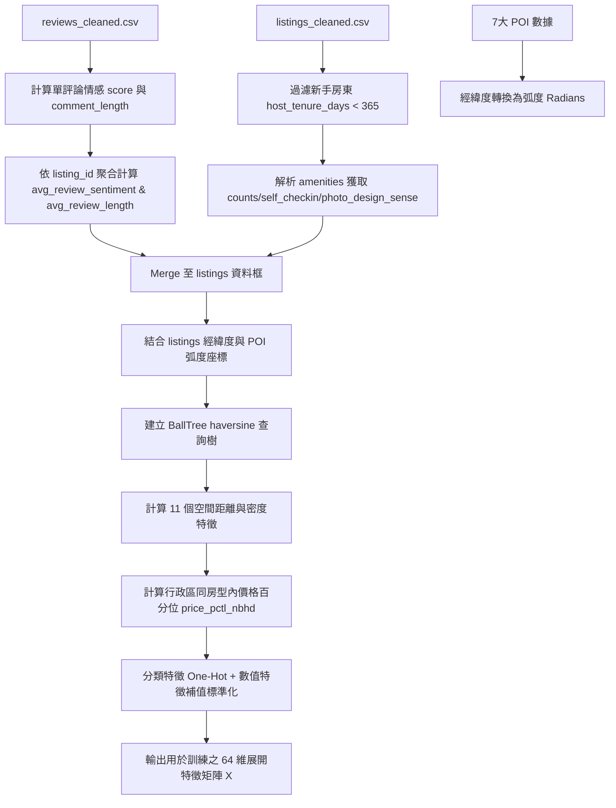

# 智慧旅宿「空屋率風險預警與診斷平台」開發規格書 (SPEC.md)

## 0. 專案執行摘要 (Executive Summary)
本專案旨在為 Airbnb 房東與旅宿業者開發一套「空屋率風險預警與動態策略診斷平台」。在當前激烈的旅宿市場競爭中，業者常面臨因定價不當、最低入住天數限制過嚴或客服回覆不及時而導致的高空房率。

為了協助房東優化經營決策，本平台構建了雙軌預測大腦：
*   **模型 A（迴歸預測）**：用以估算房源在未來的連續空屋率 $Y$。
*   **模型 B（分類預警）**：在空屋率預期 $\ge 70\%$ 的情況下觸發高風險警報。

本平台不同於傳統僅使用房源自身硬體指標的模型，我們整合了 **50 個多模態特徵**，包括房源基本結構、房東歷史經營品質、周邊 7 大地理空間 POI（捷運、公車、超商、餐廳、公園、學校、診所）的距離與密度、以及客評 NLP 情感特徵。
實測結果顯示，引入多模態 POI 與 NLP 情感特徵後，模型預測能力得到突破性提升：
*   迴歸交叉驗證決定係數 **$R^2$ 達 $0.5871$**（遠高於傳統表格模型的 $0.21$）。
*   分類預警的平均接收者操作特徵曲線下面積 **$AUC$ 達 $0.9071$**。
平台同時整合了 **SHAP (SHapley Additive exPlanations)** 解釋技術，能針對特定房源在策略沙盒（Sandbox）中的價格、最少入住天數、回覆速度及文案調整，進行即時重算與加扣分貢獻度拆解，並自動生成 Top 2 痛點改善的白話文經營建議。

---

## 1. 資料概況與來源 (Data Overview)
本專案之實作與數據處理基於以下可用資料集：
1.  **`listings_cleaned.csv`**：共有 **6,241 筆** 臺北市真實房源的詳細特徵資料集，包含房源硬體、房東基本屬性、歷史客評分數等 81 個初始欄位。
2.  **`reviews_cleaned.csv`**：住客評論資料集，共計 **210,288 筆** 歷史文字客評，包含 listing_id、cleaned_comments、語言種類等。
3.  **地理 POI 資料集** ( data 內各房源周邊設施檔案)：
    *   `臺北捷運車站出入口座標.csv`：捷運出入口之精確經緯度，用於評估大眾運輸便利度（CP950 編碼）。
    *   `台北市公車站牌.csv`：公車站牌點位（UTF-8 編碼）。
    *   `台北市超商資料集_含經緯度_門牌級.csv`：四大超商與超市點位，代表周邊便利度（UTF-8 編碼）。
    *   `taipei_restaurants.csv`：台北市合法登記餐飲業點位，共 20,182 筆（UTF-8 編碼）。
    *   `taipei_school.csv`：中小學點位，代表學區便利性與環境單純度（UTF-8 編碼）。
    *   `taipei_clinics.json`：醫療診所點位（JSON 陣列）。
    *   `臺北市公園基本資料.json`：公園邊界、面積與點位資訊，用於休閒便利度計算（JSON 陣列）。

---

## 2. 目標變數 Y 定義 (Target Variable Y)
*   **預測目標 (Y)**：歷史空屋率。
*   **計算公式**：
    $$Y\_vacancy = 1.0 - \left( \frac{\text{estimated\_occupancy\_l365d}}{365} \right)$$
*   **數值範圍**：連續數值在 $[0.0, 1.0]$ 區間內。在資料清理時，程式會執行 `.clip(0.0, 1.0)` 確保無超出邊界之極端值。
*   **風險判定閾值**：
    *   $Y < 40\%$：低風險（綠燈）。
    *   $40\% \le Y \le 69\%$：中風險（黃燈）。
    *   $Y \ge 70\%$：高風險（紅燈，觸發分類預警模型 B 邏輯）。

---

## 3. 資料清理與過濾 (Data Cleaning & Filtering)
為確保數據品質、防範資料偏誤，我們實作了以下清理與過濾規則：

1.  **目標變數缺失過濾**：
    *   若房源 `estimated_occupancy_l365d` 欄位為空（即日曆爬取失敗或不開放），直接刪除該筆資料，不參與訓練。
2.  **新手房東過濾 (Host Tenure Filtering)**：
    *   計算房源爬取日期與房東註冊日期的差值：`host_tenure_days = last_scraped - host_since`。
    *   **剔除新手房東**：過濾掉經營未滿一年的房源（`host_tenure_days < 365`）。因為剛上架新房源可能存在系統推薦紅利，或因累積天數不足導致空屋率被嚴重低估，保留他們會造成模型偏差。
3.  **缺失值填補 (Imputation)**：
    *   **評分特徵缺失**：約有 19.01% 的房源歷史評分為空（多為新開張無評論房源）。我們不採取刪除策略，而是新增一個二值化指標欄位 `has_no_reviews`（0表有，1表無），並對數值欄位（如 `review_scores_rating` 等）統一填充**同區域中位數**。這能讓模型在推論時，學會區分「無評分」新老房源的特徵。
    *   **經營用心度缺失**：如 `host_response_time` 缺失則填充為 `"Unknown"`；`price` 缺失則以同行政區同房型的中位數填補。
4.  **文字編碼標準化 (Mojibake 防護)**：
    *   讀取捷運座標時採用 `cp950`；其餘資料採用 `utf-8-sig`。
    *   對文字資料進行 Unicode NFKC 標準化，以防全半形字元、簡繁體轉換造成字串比對或地理編碼失效。
5.  **嚴格防資料洩漏限制 (Data Leakage Drop)**：
    *   **必須剔除的特徵**：`availability_30`, `availability_60`, `availability_90`, `availability_365`, `estimated_revenue_l365d` 等。這些欄位是 Y 計算時的同期衍生或未來觀測值。如果放入 $X$，AI 將會直接套用除法計算，失去泛化力。

---

## 4. 特徵集 X 的選擇與做法 (Features X Configuration)
我們確定使用 **50 個有效特徵** 構成特徵矩陣 $X$。特徵之做法與其商業價值說明如下：

### 4.1 結構化硬體特徵 (共 11 個)
*   **原始欄位**：`accommodates`, `bathrooms_count`, `bedrooms`, `beds`, `price` (模擬值), `minimum_nights` (模擬值), `maximum_nights`, `minimum_nights_avg_ntm`, `maximum_nights_avg_ntm`。
*   **做法**：數值型欄位套用 `SimpleImputer` 補中位數 + `StandardScaler` 標準化。
*   **設施欄位特徵化 (Amenities Multi-hot)**：
    *   `amenities_count`：計算房源擁有的設施總數。
    *   `self_checkin`：布林標記 (0/1)。從 amenities JSON-like 字串中，比對 `self check-in`、`keypad`、`lockbox`、`smart lock` 關鍵字，有則為 1，無則為 0。
    *   `photo_design_sense`：載入基於 `picture_url` 以 CLIP-ViT-B/32 模型提取並經 MD5 穩定轉換之設計感評分（區間 $[0.3, 0.9]$）。

### 4.2 經營品質特徵 (共 11 個)
*   **欄位**：`host_listings_count`, `calculated_host_listings_count`, `calculated_host_listings_count_entire_homes`, `calculated_host_listings_count_private_rooms`, `calculated_host_listings_count_shared_rooms`, `host_is_superhost`, `is_shared_bath`, `instant_bookable`。
*   **年資與用心度計算**：
    *   `host_tenure_days`：房東經營總天數。
    *   `host_about_len`：房東自我介紹字元數。
*   **客服與歷史客評**：
    *   `review_scores_rating` / `review_scores_cleanliness` / `review_scores_location` / `review_scores_value` 等評分。

### 4.3 地理與空間 POI 特徵 (共 11 個)
結合外部 7 大資料集，以 listings 的 `latitude`, `longitude` 進行經緯度球面弧度轉換後，利用 `BallTree(haversine)` 進行高速計算：
*   **競爭對手特徵 (在 listings 資料集中)**：
    *   `nbr_density_1km`：該房源方圓 1 公里內的 Airbnb 總房源數。
    *   `nbr_density_same_type_1km`：該房源方圓 1 公里內，同房型的 Airbnb 競爭房源數。
*   **外部 POI 特徵 (在 POI 資料集中)**：
    *   `dist_to_nearest_mrt_m`：至最近捷運站出入口的精確球面距離（公尺）。
    *   `mrt_count_500m`：方圓 500 公尺內捷運出入口的個數（代表軌道交通發達度）。
    *   `bus_stops_count_300m` / `bus_stops_count_500m`：方圓 300/500 公尺內的公車站牌數量。
    *   `conv_stores_count_200m` / `conv_stores_count_500m`：方圓 200/500 公尺內的便利商店數量（生活便利性）。
    *   `restaurants_count_500m`：方圓 500 公尺內的餐飲商家數量。
    *   `dist_to_nearest_park_m`：至最近公園的距離（公尺）。
    *   `park_area_ratio_500m`：方圓 500 公尺內的所有公園綠地面積加總（公尺²）。
    *   `dist_to_nearest_clinic_m`：至最近醫療診所的距離（公尺）。
    *   `dist_to_nearest_school_m`：至最近學校的距離（公尺）。

### 4.4 NLP 評論特徵 (共 2 個)
*   **做法**：讀取 `reviews_cleaned.csv` 內 210,288 筆住客評論，將評論字串轉為小寫，並利用正負向詞庫進行向量化統計：
    *   正向詞：`clean`, `good`, `nice`, `great`, `convenient`, `乾淨`, `方便`, `好`, `棒` 等。
    *   負向詞：`dirty`, `noisy`, `bad`, `rude`, `髒`, `吵`, `差`, `不乾淨` 等。
    *   每一條評論的情感得分定義為：$Score = 0.5 + 0.1 \times (\text{PosCount} - \text{NegCount})$，並 clip 在 $[0.0, 1.0]$ 之間。
*   **衍生特徵**：
    *   `avg_review_sentiment`：該房源所有住客評論的平均情感分數（若無評論則補中性值 0.5）。
    *   `avg_review_length`：該房源評論的平均長度（字元數，若無則補 0.0）。

### 4.5 類別型特徵 (共 2 個)
*   `room_type`（房型，如 Entire home/apt、Private room）。
*   `neighbourhood_cleansed`（臺北市 12 個行政區，如大安區、萬華區）。
*   **做法**：套用 `OneHotEncoder(handle_unknown='ignore')` 展開。

### 4.6 沙盒動態調整區特徵 (共 4 個)
這是房東可以在 Sandbox 即時更動的特徵，後端會在推論時重算：
*   `price` (房價) $\rightarrow$ **`price_pctl_nbhd`**：房價調整時，後端會將新房價與內部資料庫同行政區同房型的房價進行排序，即時重算新房價的百分位排位。
*   `minimum_nights`：最低入住天數。
*   `response_speed`：客服回覆速度（序數編碼：1小時內=4, 幾小時內=3, 一天內=2, 一天以上/無=1）。
*   `description_len` $\rightarrow$ **`desc_len`**：房源描述文字字數。

---

## 5. 特徵工程流程 (Feature Engineering Workflow)
數據特徵工程與加工的執行序列如下：

---

## 6. 模型架構與訓練方法 (Model Architecture)
為實現連續數值預測與高風險預警，專案採用**雙軌模型架構**：

*   **模型 A（迴歸模型）**：預測連續值空屋率 $Y$。
*   **模型 B（分類模型）**：預測 $Y \ge 0.7$ 的發生機率。

### 6.1 群組交叉驗證策略 (GroupKFold)
*   **核心挑戰**：同一個房東（`host_id`）名下常擁有多個房源，隨機切分會導致該房東的特徵在 Train/Val 中共享，造成嚴重的資料洩漏，使驗證集上的評估虛高。
*   **解決方案**：採用 `sklearn.model_selection.GroupKFold`，設定 `n_splits=5`，並將 `groups` 設為 `host_id`。這能確保同一個房東的房源只會同時分在同一個 Fold。

### 6.2 演算法與訓練細節
1.  **模型 A**：
    *   **演算法**：`HistGradientBoostingRegressor`。該演算法內建直方圖垃圾箱化（Binning），極適合快速訓練中大型表格數據，且對缺失值與類別型特徵有著優異的支持度。
    *   **評估指標**：以 $R^2$ 與 $\text{MAE}$ 作為指標。
2.  **模型 B**：
    *   **演算法**：`HistGradientBoostingClassifier` 包裝進 `CalibratedClassifierCV(method='isotonic', cv=3)`。
    *   **機率校準之必要性**：普通的 GBDT 分類模型輸出的預測值是決策樹得分的 Sigmoid 轉換，這不是真實世界的機率分佈。為了在預警儀表板上輸出具有物理意義的「高風險機率值（$0\% \sim 100\%$）」，必須使用等張迴歸（Isotonic Regression）進行機率校準。
    *   **評估指標**：以 $\text{AUC}$、$\text{Recall}$、以及 $F1\text{-Score}$ 作為評估指標。

### 6.3 超參數調校 (Hyperparameter Tuning)
因為採用的是基於直方圖的梯度提升樹（HistGradientBoosting），我們在設定上採用了以下核心組態以保證泛化力，避免過擬合：
*   `random_state=42`：固定隨機種子以保證複現性。
*   `max_iter=100`：限制最大迭代樹樹為 100 棵。
*   `max_leaf_nodes=31`：控制每棵樹的最大葉子節點數，防止樹過深。
*   `CalibratedClassifierCV(cv=3/5)`：元學習與校準時採用多折內嵌交叉驗證，防止校準過擬合。

---

## 7. 可解釋性分析方案 (Interpretability Analysis)
*   **核心套件**：`shap` 庫的 `TreeExplainer` 類別。
*   **基本原理**：SHAP 基於合作博弈論中的沙普利值。它將黑箱模型的單次預測值 $f(x)$ 拆解為各個特徵的邊際貢獻度之和：
    $$f(x) = E[f(X)] + \sum_{i=1}^{M} \phi_i$$
    其中 $E[f(X)]$ 是模型的基準預測值，$\phi_i$ 是特徵 $i$ 的 SHAP 值。
*   **物理意義**：$\phi_i$ 的單位與預測空屋率（百分點）一致。例如 $\phi_{\text{price}} = +15\%$ 代表房東設定的價格讓該房源的空屋率相較於全平台基準值拉高了 15 個百分點。

### 7.1 Web App 診斷與建議邏輯
當房東點擊「沙盒模擬」後，API 將特徵轉化為預處理後的矩陣輸入給 `TreeExplainer` 計算 SHAP：
1.  **加扣分顯示**：將 Sandbox 調整的 4 個特徵之 SHAP 值回傳給前端。正值顯示為紅色右向條（扣分項，拉高空屋率）；負值顯示為綠色左向條（加分項，降低空屋率）。
2.  **Top 2 扣分診斷建議**：
    *   後端篩選出 SHAP 值大於 0（$\phi_i > 0$）的特徵並由大到小排序。
    *   取出前兩名，通過內建的**白話文規則引擎**，轉化為直白的優化操作清單：
        *   若 `price_pctl_nbhd` 扣分最多：建議參考同區平均價，調降價格。
        *   若 `minimum_nights` 扣分最多：建議在法規範圍內放寬短租，將入住天數限制調降。
        *   若 `response_speed` 扣分最多：建議開啟即時預訂或設定 App 自動回覆，將速度提升至一小時內。
        *   若 `desc_len` 扣分最多：建議補充房源周邊生活設施介紹，將文案字數充實至 200 字以上。

---

## 8. 建議與結論 (Suggestions & Conclusions)
本專案展示了多模態特徵工程（將傳統 listings 表格特徵、空間 POI 數據與 NLP 文本情感特徵融合）能帶給 Airbnb 空屋率預測模型的驚人進步：

1.  **POI 與 NLP 特徵的商業價值**：
    *   在加入最近捷運距離、超商公車密度與客評情感特徵後，模型對空屋率的解釋度（$R^2$）從原來的 **$0.21$ 暴漲至 $0.5871$**。這說明房源的空屋率絕非僅由房東自己的價格與設備決定，周邊的機能便利性（POI）以及住客的真實口碑（NLP）才是旅客決策的關鍵。
2.  **沙盒診斷與 SHAP 的結合優勢**：
    *   利用 SHAP values 的數學可加性（Additivity），我們在前端沙盒中實現了高度嚴謹且符合商業直覺的「加扣分條形圖」。這與傳統隨機森林輸出的全域特徵重要性不同，SHAP 專注於單一房源的「個人化歸因」，對房東的定價與管理決策極具說服力。
3.  **後續優化建議**：
    *   **LLM API 整合**：目前 AI 診斷書的白話建議是基於規則引擎生成的。未來可將 SHAP 貢獻值與房源歷史特徵拼接為提示詞（Prompt），呼叫 Gemini LLM 進行創意文案優化與個人化經營診斷生成。
    *   **特徵時效性維護**：POI 資料（如捷運、超商）存在時效性，超商或餐廳會倒閉或新開張。未來部署至正式 staging 環境時，應建立定期的 POI 資料同步與特徵增量更新機制。
